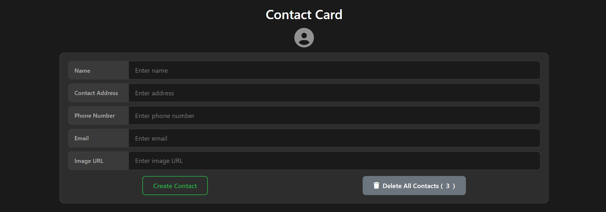
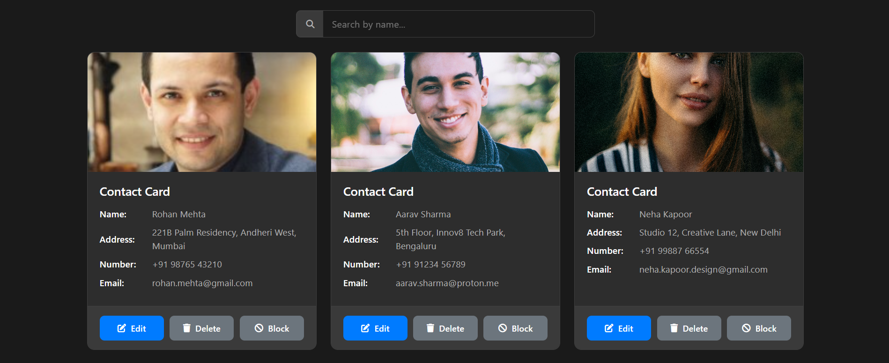
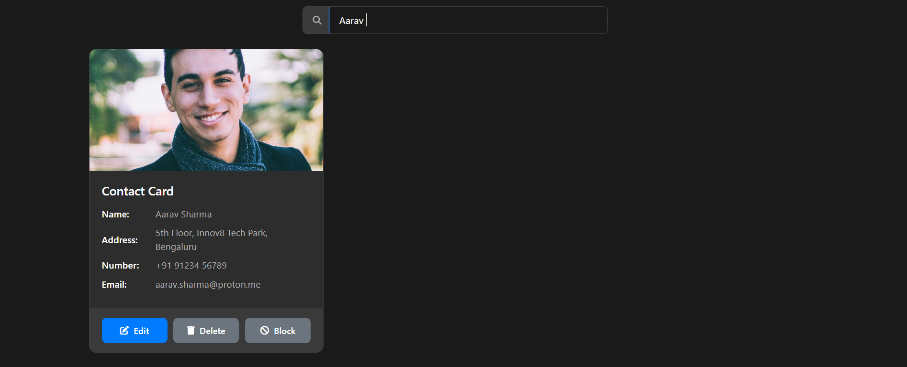
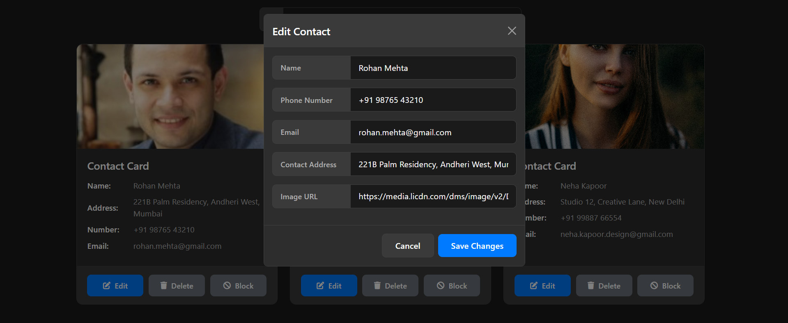

# ContactBook

**Contact Book web application** built using **HTML, CSS, and vanilla JavaScript**.  
It allows users to manage contacts efficiently with full CRUD functionality, search, and persistent storage using **localStorage**.


## Features
- Add new contacts with validated name, address, phone, email, and image URL
- Edit existing contacts
- Delete individual contacts
- Real-time search by name
- Persistent data using browser localStorage


## Tech Stack
- **HTML5**, **CSS3**, **JavaScript (Vanilla)**, **Bootstrap 5**, **Font Awesome**

## 📸 Screenshots

### Empty State


### Contacts Added


### Search Contacts


### Edit Contact



## How It Works
1. User fills in the contact form and creates a contact
2. Contacts are stored in `localStorage`  
3. Cards are rendered dynamically in a responsive grid  
4. Users can search, edit, block, or delete contacts 
5. Data persists even after page reload  

## How to Run
1. Clone the repository  
   ```bash
   git clone https://github.com/RishiBuilds/contactbook-crud.git

2. Open `index.html` in your browser

3. Start adding contacts 

## Author
**Created by [Rishi](https://github.com/RishiBuilds)** with ❤️ using vanilla js
Feel free to fork the repo, open issues, or submit pull requests!
